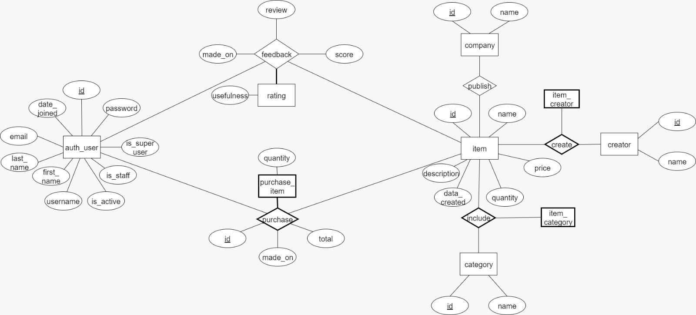

# Solid Eureka

Solid Eureka is a web application with a database backend built using Django with the implemented
features described below.

## Features
A few things that are implemented in Solid Eureka:
* Registration
* Feedback (Reviews)
* Usefulness rating
* Feedback query
* Browsing (Search)
* Ordering
* Recommendation
* User Record
* Inventory management
* Statistics

## Getting Started

These instructions will get you a copy of the project up and running on your local machine for development and testing purposes. See deployment for notes on how to deploy the project on a live system.

### Prerequisites

What you need to install and how to install them

```
# MariaDB
sudo apt-get install mariadb-server libmysqlclient-dev
sudo mysql_secure_installation

# Pipenv
pip install pipenv
pipenv --python 3.6
pipenv install

# configure and init database
cp .env.example .env
vi .env
pipenv run ./db.sh init

# webpack
npm install
npm build
```

## Built With

* [Vue](https://vuejs.org/) - Front-End framework used
* [Django](https://www.djangoproject.com/) - Back-End framework used

* [Web Pack](https://webpack.js.org/) - Dependency Management
* [npm](https://www.npmjs.com/) - Package Manager for JavaScript

* [MariaDB](https://mariadb.org/) - Open Source Relational Database


## Entity Relationship Diagram


## Contributing

Please read [CONTRIBUTING.md](misc/CONTRIBUTING.md) for details on our code of conduct, and the process for submitting pull requests to us.

## License

This project is licensed under the Apache License - see the [LICENSE.md](misc/LICENSE.md) file for details

## Authors

* [Shun Git](https://github.com/randName)
* [Guo Yuan Jing](https://github.com/guoyuanjing2988)
* Jiang Tao
* Wang Shuo
* Lee Yue Ning
* [Ong Wei Jie Joel](https://github.com/joelowj)

## Acknowledgments
* Dorien Herremans, our course instructor.
* [Jon Wong](https://github.com/jon-wong-sutd) guidance on Agile software development and inspiration to adopt a design thinking approach to Software Development for this project.
